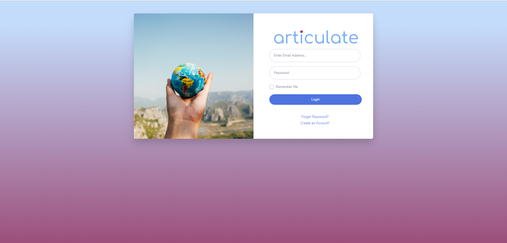
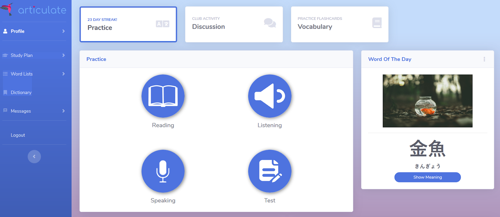
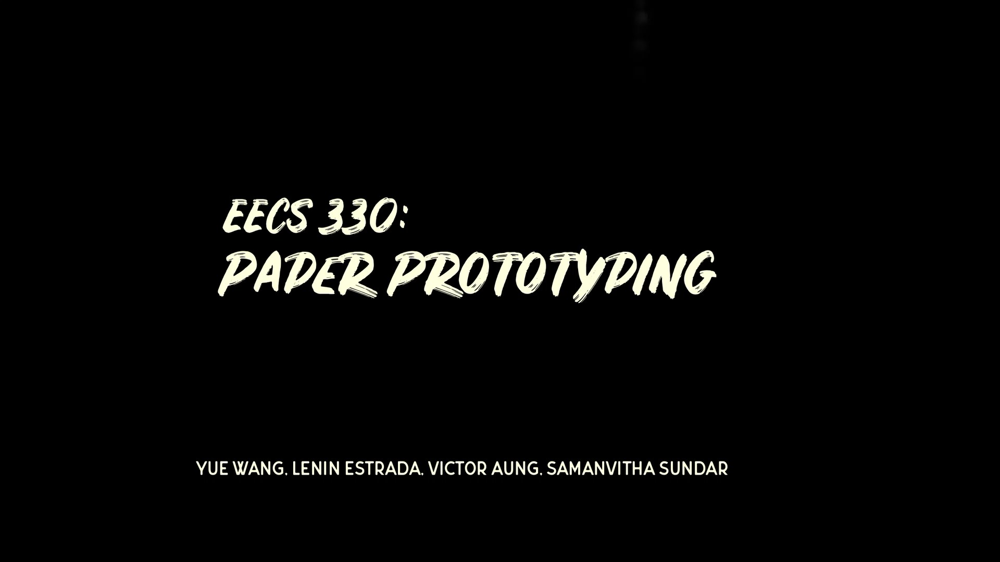
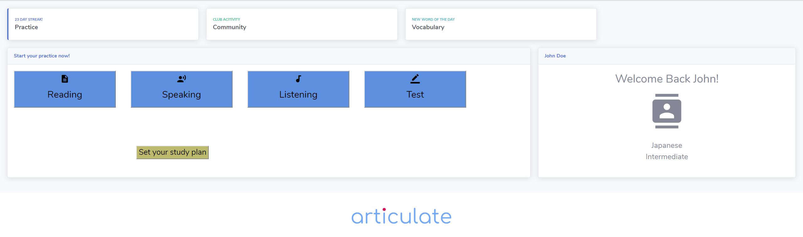
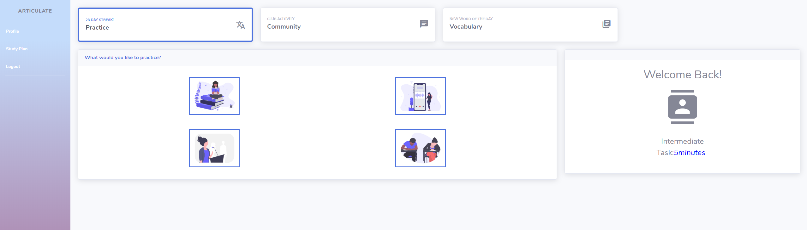
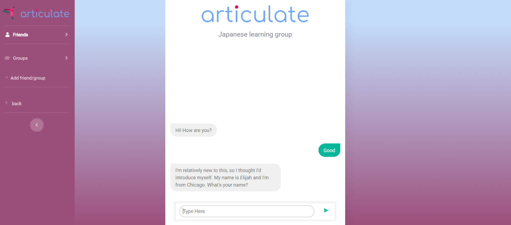

[Check out our live demo!](https://eecs-330-language-learning.github.io/articulate/dashboard.html)     

## Screenshots

Register for an account and sign in with your email and password. User data is only saved locally. You can visit the login screen by clicking on the image.

## Purpose

Articulate is a conceptual UI/UX design for a modern language learning platform. Articulate was created in 2019 for Northwestern University's EECS 330: Human Computer Interaction course.

Currently, Articulate is a fully functioning website with a small number of practice questions. That being said, although the website is functional from a design perspective, it is not developed enough to use as an actual language learning platform. If you would like to develop Articulate further, feel free to contact us!

## Problem & Motivation

One of the greatest problems regarding language acquisition is getting more individuals to learn a new language fast and efficiently. Find the full project proposal [here](READMEResources/ProblemStatement.pdf).

## Development Process

### Paper Prototype

The very first iteration of Articulate was a simple, low-fidelity paper prototype. We used the paper prototype as a quick way to gather a lot of user feedback before we spent time doing any coding. This round of prototyping was perhaps the most important and set the foundation for what our app would eventually look like.

The full user briefing as well as list of resolutions can be found [here](READMEResources/PaperPrototyping.pdf).

Click on the image below to watch a video featuring user testing and improvements we made based off of that session.

### Computer Prototypes

The computer prototype phase took place over several weeks. Each week's goal was to finish one prototype which included one major new feature. After receiving feedback in class, we worked hard the following week to implement improvements before the next meetup. As you can see from the images below, Articulate went through significant improvement over the course of those few weeks.

## Additional Resources

### Branding

You can find our full branding philosophy [here](READMEResources/PaperPrototyping.pdf).
Articulate follows Google's Material UI protocol.

### Presentation

Our final presentation can be found [here](https://docs.google.com/presentation/d/161vOqKf8RsRAYEyWmKp7KrW1504deFHgn3JLU3_I5xE/edit?usp=sharing).

## Developers

Victor Aung (https://github.com/VictorAung)

Lenin Estrada (https://github.com/R3CEPT0R)

Samanvitha Sundar (https://github.com/tuesday0928)

Yue Wang (https://github.com/YueWang9626)
